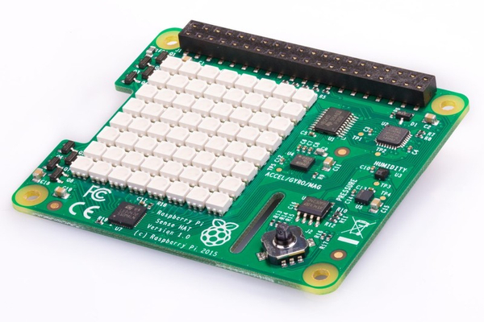

.. sensehat_ros documentation master file, created by
   sphinx-quickstart on Wed Aug 12 12:17:33 2020.
   You can adapt this file completely to your liking, but it should at least
   contain the root `toctree` directive.

sensehat_ros's documentation
============================

Overview
--------

The **sensehat_ros** ROS package helps integrating the Astro Pi `Sense HAT`_ sensor module with the ROS  
ecosystem.
Stick events together with environmental and IMU sensors data are published to ROS topics.
Several ROS services are exposed to interact with the device sensors and with the LED matrix.

Please, follow the official Sense HAT `Python API`_ documentation to get a better picture of the device capabilities.

This package is one of the results of a personal effort in learning ROS and taking advantage of hardware already owned.
It has been tested on Melodic Python 2 and Noetic Python 3 environments. ROS 2 support is in the roadmap, any help would be appreciated.
Deployment tests with the Sense HAT device were successfully run on different Raspberry PI models, 
either installing ROS on the Raspberry Pi OS or using Docker via the Balena Cloud platform.

Thanks to the sense-emu_ Python package, the **sensehat_ros** package can be run without the actual
Sense HAT device on several Linux configs. Simulated deployments were tested on x86 Ubuntu Bionic and
Debian Buster (via WSL 2) and with Docker on both x86 and QEMU-based arm32v7.

.. _`Sense HAT`: https://www.raspberrypi.org/products/sense-hat/
.. _sense-emu: https://pypi.org/project/sense-emu/
.. _`Python API`: https://pythonhosted.org/sense-hat/api/

Contents
--------

.. toctree::
   :maxdepth: 2

   setup
   usage
   rosnodes
   changelog

Indices and tables
------------------

* :ref:`genindex`
* :ref:`modindex`
* :ref:`search`