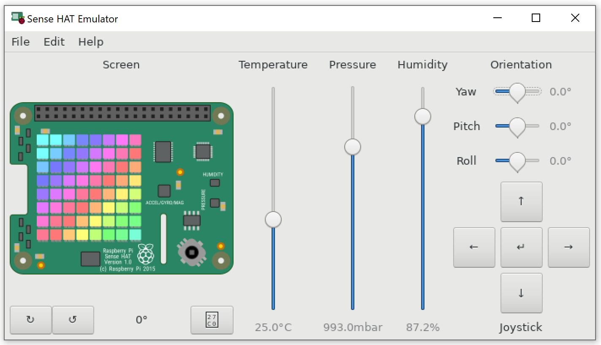

Setup
=====
The **sensehat_ros** package is intended to be installed on a Raspberry PI device equipped with an 
Astro Pi `Sense HAT`_ module and with a supported ROS distro.

Binary release is WIP so the package should be built and installed from source.

.. _`Sense HAT`: https://www.raspberrypi.org/products/sense-hat/

Build
-----
The package can be built by `catkin_make` after creating a ROS workspace and installing 
dependencies with `rosdep`

.. code-block:: bash

    $ mkdir -p ~/catkin_ws/src
    $ git clone https://github.com/allxone/sensehat_ros.git ~/catkin_ws/src/sensehat_ros
    $ cd ~/catkin_ws
    $ rosdep update
    $ rosdep install --from-paths src --ignore-src -r -y
    $ catkin_make

Test
----
The package includes several tests that can be used to verify if the package works properly.

Tests can target either an actual Sense HAT shield installed on a Raspberry PI or emulated
hardware on a Linux distribution running on x86 or ARM.

The sense-emu_ Python package support the Sense HAT hardware emulation and the included node
tests run, by default, leveraging a prerecorded hardware trace (via the sense_play command).

Specifying the environment variable SENSEHAT_ROS_EMU_GUI=1, sense_play recorded trace is not
played and sense_emu_gui is automatically triggered, if not already running. Take a look at 
the sense-emu documentation because the GUI may require installing additional OS packages.

.. code-block:: bash

    # The sense_emu_gui is already running
    $ export SENSEHAT_ROS_EMU_GUI=1
    $ source devel/setup.bash
    $ catkin_make run_tests

.. _sense-emu: https://pypi.org/project/sense-emu/

Install
-------
Once the package has been built, it can be installed with che catkin command

.. code-block:: bash

    $ catkin_make install
    $ source install/setup.bash
