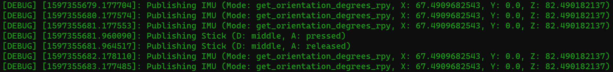

Usage
=====

Configuration
-------------

Several parameters are used to configure the **sensehat_ros** package during the node initiliazation.

This is a sample parameter file:

.. code-block:: yaml

  sensehat_ros:
    rotation: 0
    low_light: True
    smoothing: 5
    environmental_publishing: True
    environmental_publishing_rate: 12
    imu_publishing: True
    imu_publishing_rate: 1
    imu_publishing_mode: "get_orientation_degrees_rpy"
    imu_publishing_config: "1|1|1"
    stick_publishing: True
    stick_sampling: 0.2  

The parameter file can be referenced in a roslaunch launch file like this:

.. code-block:: xml

  <launch>
      <rosparam file="$(find sensehat_ros)/config/sensehat_ros.yaml" command="load"/> 
      <node pkg="sensehat_ros" type="sensehat_ros" name="sensehat_ros" respawn="true"/>
  </launch>

This is a brief description of the available parameters. Further details can be find in the module documentation.

* **rotation** and **low_light** parameters map to the matching properties in the `Sense HAT API`_.
* **smoothing** specifies the number of obsersavations to be used for median smoothing (0 to disable smoothing). Smoothing is applied only to environmental data (humidity, temperature and pressure).
* **environmental_publishing** enable publishing of Environmental messages into *Environmental* topic every **environmental_publishing_rate** seconds.
* **imu_publishing** enable publishing of IMU messages into *IMU* topic every **imu_publishing_rate** seconds.
* **imu_publishing_mode** determines the content of the IMU message published to the *IMU* topic.
  
  Available options are:

  * get_orientation_radians_rpy
  * get_orientation_degrees_rpy
  * get_compass_raw_xyz
  * get_gyroscope_rpy
  * get_gyroscope_raw_xyz
  * get_accelerometer_rpy
  * get_accelerometer_raw_xyz

  Modes ending with *_rpy* assign (roll, pitch, yaw) values to IMU message (x, y, z).
* **imu_publishing_config** calls the `set_imu_config` command before starting the IMU message stream, enabling/disabling compass|gyroscope|accelerometer. When IMU publishing is enabled the GetIMU service is disabled due to potential `set_imu_config` interference.
* **stick_publishing** enable publishing of Stick messages into *Stick* topic. Events are sampled from the device every **stick_sampling** seconds.

Test run
--------
To verify if the **sensehat_ros** package is working properly a ROS node can be started with a modified logging level and published information 
can be tracked by DEBUG level logs without subscribing to topics or invoking services.
Triggering the joystick on the device or the emulator should be immediately mirrored in the onscreen log output.

.. code-block:: bash
  
  $ source install/setup.bash
  $ roslaunch --screen -v sensehat_ros sensehat_ros.launch DEBUG:=True

Examples
--------
The package includes two sample nodes to show how to call services interactively or consume messages from topics.

.. code-block:: bash

  # Assuming "roslaunch sensehat_ros sensehat_ros.launch" already running in another shell
  $ source install/setup.bash
  
  # Example 1: invoking sensehat_ros ROS services
  $ rosrun sensehat_ros sample_client
  Received Environmental (H: 39.73828125, TH: 20.9375, TP: 20.9520833333, P: 995.614257812)
  Reset the Matrix to white
  Show some random pixel colors
  Reset the Matrix to black

  # Example 2: consuming sensehat_ros topics
  $ rosrun sensehat_ros sample_listener
  [INFO] [1597358715.590474]: Heard Environmental (H: 39.2265625, TH: 20.90625, TP: 20.8791666667, P: 995.602294922)
  [INFO] [1597358715.597447]: Heard IMU (Mode: get_orientation_degrees_rpy, X: 67.4909682543, Y: 0.0, Z: 82.490182137)
  [INFO] [1597358716.590834]: Heard IMU (Mode: get_orientation_degrees_rpy, X: 67.4909682543, Y: 0.0, Z: 82.490182137)
  [INFO] [1597358717.590532]: Heard IMU (Mode: get_orientation_degrees_rpy, X: 67.4909682543, Y: 0.0, Z: 82.490182137)
  ^C

.. _`Sense HAT API`: https://pythonhosted.org/sense-hat/api/